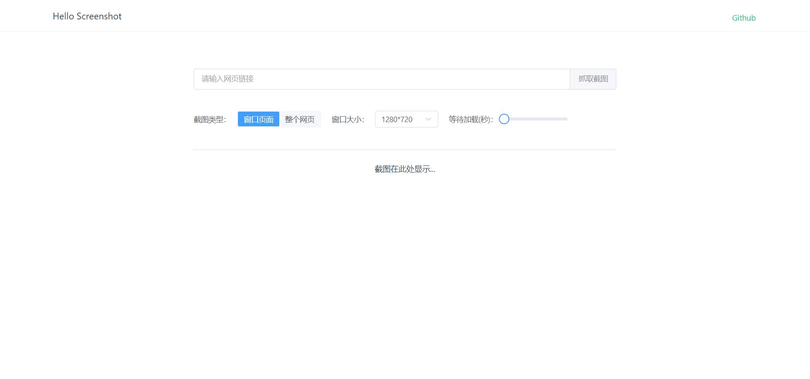

# hello_screenshot

利用playwright自动化工具，实现网页截图功能，并且可通过api接口服务获取网页截图

# 安装

docker-compose.yml

```
version: '3'
services:
  hello_screenshot:
    image: ghcr.io/luler/hello_screenshot:latest
    privileged: true
    ports:
      - 14140:14140
```

运行

```
docker-compose up -d
```

# 使用

访问示例页面
> http://localhost:14140/

> 访问接口：

> http://localhost:14140/screenshot

接口将返回png图片内容

参数控制：

| 字段              | 是否必填 | 类型     | 简介                           |
|-----------------|------|--------|------------------------------|
| url             | 否    | string | 网页地址                         |
| viewport_width  | 否    | int    | 视窗宽度                         |
| viewport_height | 否    | int    | 视窗高度                         |
| full_page       | 否    | int    | 截图类型，0-窗口页面，1-整个网页           |
| wait_second     | 否    | int    | 等待加载时间，单位秒（有些页面异步加载数据可能需要等待） |

# 演示地址

https://cas.luler.top/?search=664f16483a8d2

# 参考图片

> 示例页面


